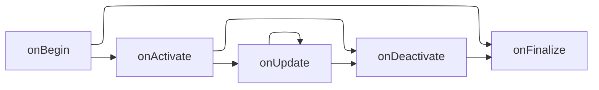
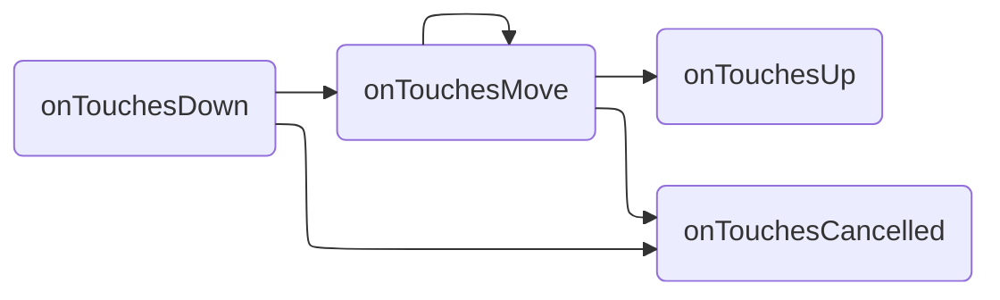

import CodeBlock from '@theme/CodeBlock';

Every gesture can be treated as ["state machine"](https://en.wikipedia.org/wiki/Finite-state_machine).
At any given time, each handler instance has an assigned state that can change when new touch events occur or can be forced to change by the touch system in certain circumstances.

## Events

There are two types of events in RNGH3: `GestureEvent` and `TouchEvent`.

- `GestureEvent` carries a gesture-specific data along with `handlerTag`.
- `TouchEvent` carries information about raw touch events, like touching the screen or moving the finger. 

## Callbacks

### onBegin

```ts
onBegin: (event: GestureEvent<HandlerData>) => void
```

Called when a handler begins to recognize gestures.

### onActivate

```ts
onActivate: (event: GestureEvent<HandlerData>) => void
```
 
Called when activation criteria for handler are met.

### onUpdate

```ts
onUpdate: (event: GestureEvent<HandlerData>) => void
```

Called every time a gesture is updated after it has started.

### onDeactivate

```ts
onDeactivate: (event: GestureEvent<HandlerData>, didSucceed: boolean) => void
```

Called after when handler stops recognizing gestures, but only if handler activated. It is called before `onFinalize`. If the handler was interrupted, the `didSucceed` argument is set to `false`. Otherwise it is set to `true`.

### onFinalize

```ts
onFinalize: (event: GestureEvent<HandlerData>, didSucceed: boolean) => void
```

Called when handler stops recognizing gestures. If handler managed to activate, the `didSucceed` argument is set to `true` and `onFinalize` will be called right after `onDeactivate`. Otherwise it is set to `false`.

### onTouchesDown

```ts
onTouchesDown: (event: GestureTouchEvent) => void
```

Called when new pointers are placed on the screen. It may carry information about more than one pointer because the events are batched.

### onTouchesMove

```ts
onTouchesMove: (event: GestureTouchEvent) => void
```

Called when pointers are moved on the screen. It may carry information about more than one pointer because the events are batched.

### onTouchesUp

```ts
onTouchesUp: (event: GestureTouchEvent) => void
```

Called when pointers are lifted from the screen. It may carry information about more than one pointer because the events are batched.

### onTouchesCancelled

```ts
onTouchesCancelled: (event: GestureTouchEvent) => void
```

Called when there will be no more information about this pointer. It may be called because the gesture has ended or was interrupted. It may carry information about more than one pointer because the events are batched.

## Callbacks flow

### GestureEvent callbacks



### TouchEvent callbacks



